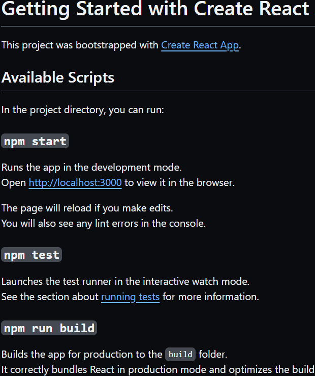
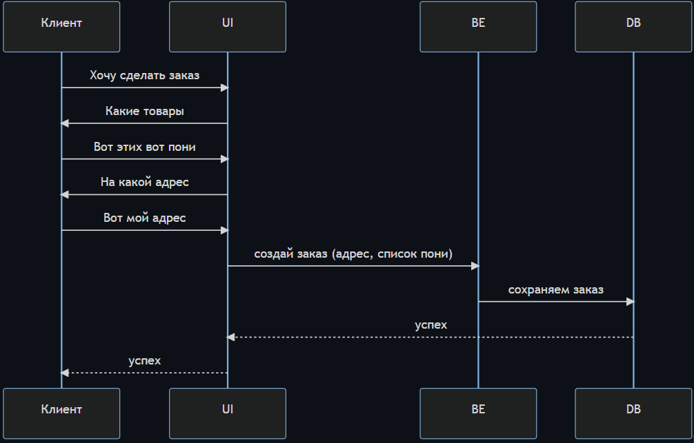
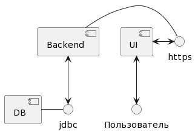
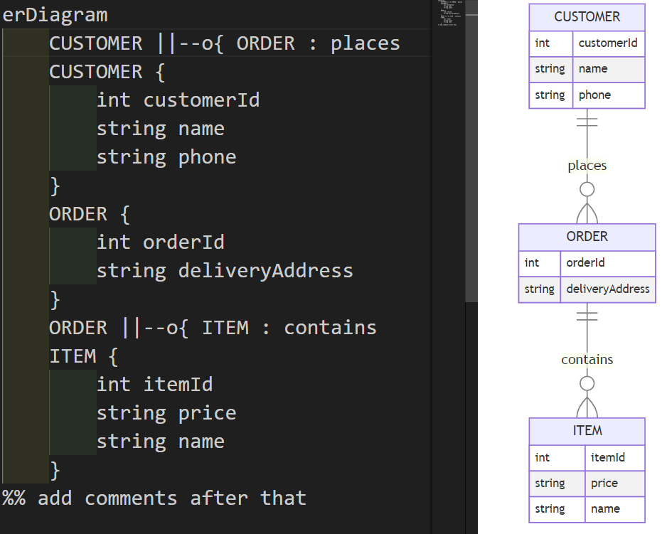
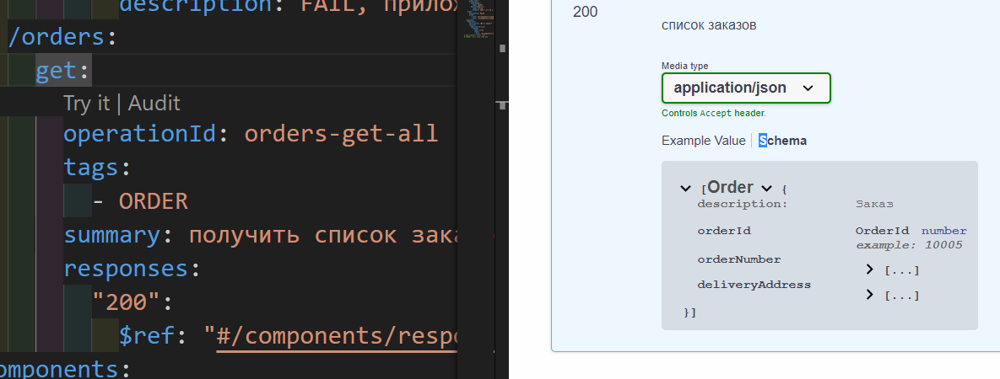
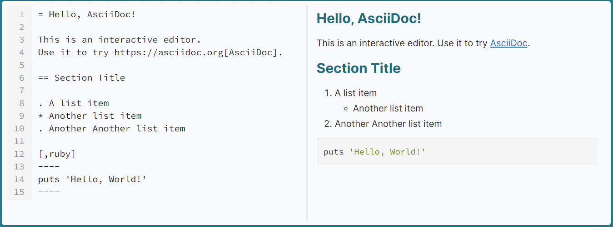
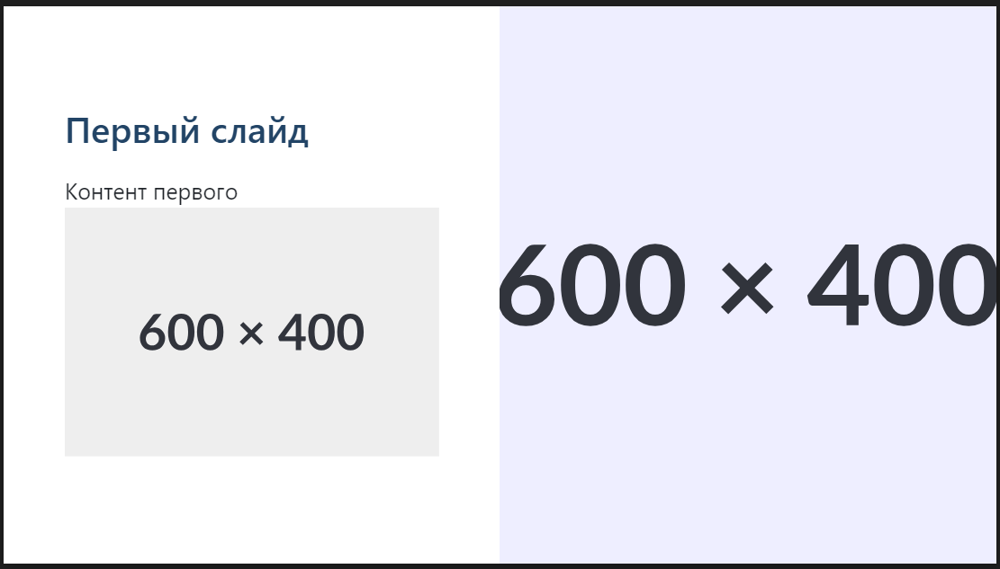
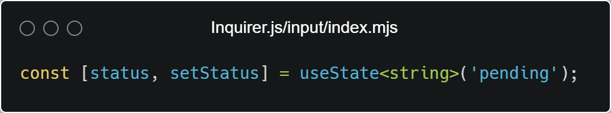
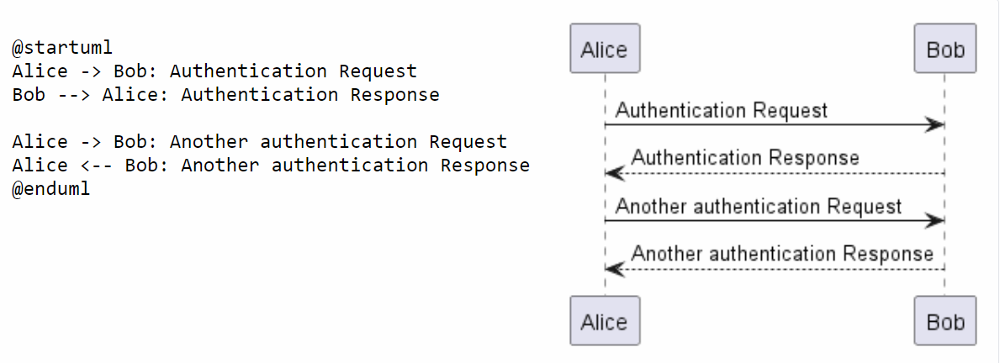
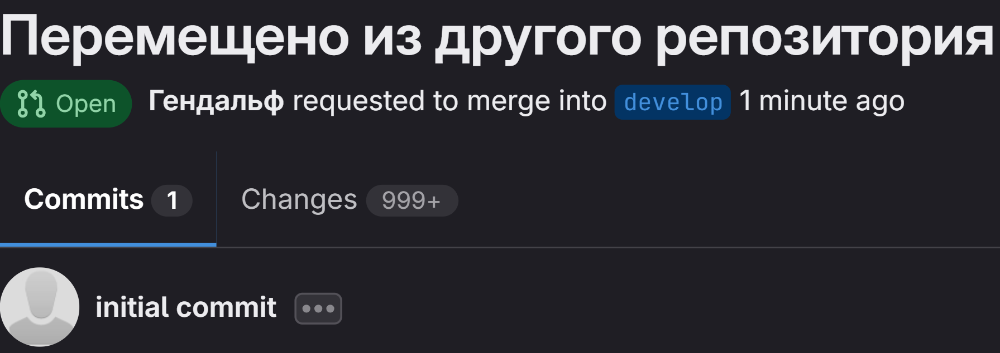

## Про дизайн, но технический. Зачем и как?

----


* 7 лет в коммерческой разработке
* 5 команд
* 7 продуктов
* 4 роли
    * тестировщик
    * разработчик
    * тимлид
    * наставник
* 🏄‍♂️ 👩‍💻 🍻
<style scoped>ul { list-style: none; }</style>
🙏 [telegramm](https://t.me/alexey_shcherbakov) | [linkedin](https://www.linkedin.com/in/shcherbakov/) | [GitHub](https://github.com/akaguny)

<!-- 
последние 7 лет я занимаюсь разработкой ПО
за это время удалось поработать в 5 командах
над 7 продуктами в различных ролях.
с гордостью могу сказать что побывал в ролях
тестировщика ручного и автоматизатора
разработчика, тимлида и наставника.
последние 3 года занимаюсь управлением командой совместно с разработкой frontend
 -->


## План
* Зачем нужен технический дизайн?
<!-- описание контекста, в котором работаю, с какими проблемами сталкиваюсь и чем помогает технический дизайн -->
* Что такое технический дизайн и чем отличается от технической документации?
<!--  -->
* В чём мой "чемпионский подход к ведению технических дизайнов"?
  * Как это работает?
  * Какие инструменты использованы?
* Итоги

## Зачем нужен технический дизайн?

## Контекст проекта
* техника
* процессы

<style scoped>ul {font-size:48px; padding: 0; list-style: none; }</style>

## Контекст. Техника

* компонент продукта
  * frontend
  * backend
  * QG

* дифференцированный стек
  * backend - Java
  * frontend - React
  * testing - Java, Selenium
  * devOps - Ansible, Jenkins

<!-- 
Приложение, пользователями которого являются сотрудники клиента
Имеет собственный UI
Собственный backend с персистентным хранилищем - базой данных
Собственный Quality Gate - все уровни тестирования от юнит тестов и до приёмочных E2E тестов, моделирующих работу через браузер
 -->

## Контекст. Процессы

* разработка фичи "под ключ"
  * планирование
  * аналитика
  * реализация
  * поддержка
* инженеры на проекте могут меняться

<!-- 
Команда участвует на всех этапах разработки

Планирование
Подготовка документа с прогнозом по реализации с детализацией до работ по функциональных направлений - backend, frontend, тестирование и devops
Поддержка
Инженеры проекта занимаются разбором ошибок с прома

-->

## Риски
* потеря связи с реальностью
* рассинхронизация
* дорогое вхождение в проект

<!--

На таком проекте возрастают следующие риски
потеря связи с реальностью - команда разработки реализует объёмную фичу, но реализует её с критичными для бизнес потребности ограничениями

рассинхронизация - стек дифференцирован и требуется от 3 инженеров её реализующих, рискуем превратиться в героев басни лебедь, рак и щука. А узнать про всё это к моменту интеграции

дорогое вхождение в проект - вхождение в проект требует высокого погружения в контекст проекта. Что увеличивает издержки на "онбординг" как вновь прибывших в компанию, так и инженеров некогда работающих над проектом

 -->
---

* ### Похоже на ваш проект?
* ### Разрабатываете на React?


<style scoped>ul { list-style: none; }</style>

<!-- 

Доклад будет особенно полезен для тех, кто также работает в кроссфункциональной команде.
Но подходы которые мы разберём и инструменты я сейчас использую на всех проектах, где имею возможность.
 -->

# Что такое технический дизайн и чем отличается от технической документации?

<!-- 
Технический дизайн это не только техническая документация.

Далее рассмотрим основные элементы технической документации и технического дизайна, с которыми вы могли сталкиваться
 -->

---



### Readme.md - Техническая документация
* как разрабатывать
* как пользоваться
<style scoped>ul { padding: 0; list-style: none; }</style>
<!-- 
Простой пример технической документации - Readme.md
Отвечает на вопросы
как разрабатывать, как пользоваться
 -->

## RFC React. Формат
```markdown
# Summary
...
# Basic example
...
# Motivation
...
# Detailed design
...
# Drawbacks
...
# Alternatives
...
# Adoption strategy
...
# How we teach this
...
# Unresolved questions
```
<!-- 
Формат RFC - Request For Comments на примере React представляет из себя обычный Markdown файл с заданной структурой.
Но сколько замечательных и не очень фич было разработано с его использованием
 -->

<!-- _footer: "[Проект RFCs for changes to React](https://github.com/reactjs/rfcs)" -->

## RFC. Процесс
* создание
* обсуждение
* финальное решение
* активен
* реализован

<!-- процесс взят из Ember потому как он был расписан по пунктам. А React заимстовал у Yarn и Ember =) -->

<!-- 
Сам по себе файл в каком-то формате это хорошо, но это лишь инструмент.
То, как он используется описывает процесс
-->

## интернет стандартизируют через RFC
* RFC1 был опубликован 1969 году
* семейство протоколов TCP/IP описано в RFC
<!-- 
Первый RFC был опубликован в конце 60-х годов прошлого века
Весть этот наш интернет описывается через RFC
 -->

## Технические дизайн. Маппинг на процесс

* планирование - концепция
* аналитика - уточнение концепции, детальный анализ
* реализация - корректировки
* поддержка - дизайн может быть использован в документации

## Технический дизайн и техническая документация снижают риски
|риск|решение|
|---|---|
|потеря связи с реальностью|дизайн-ревью|
|рассинхрон|дизайн-ревью|
|онбординг|чтение дизайнов и документации|

## Технический дизайн вещь хорошая. Будем использовать!
## уже не аутсайдер, но ещё не чемпион

* 🧐 фиксация, структура, ревью на чек-боксах в confluence
* 🤨 20+ дизайнов
* 😶 обеспечение процесса ревью
<style scoped>ul { padding: 0; list-style: none; }</style>

<!-- похожий на RFC подход мы начали использовать с самого начала нашего проекта что обеспечило
фиксацию договорённостей, чёткую структуру, ревью на базе состояния чек-бокса около имени ревьюера

время шло, дизайнов становилось всё больше, росло дублирование, росло количество разрезов, которые надо было не забыть охватить в дизайнах, они же артефакты-дизайн документы

вместе с тем ручной мониторинг чек-боксов показал себя с хорошей стороны на начальном этапе, но потом начинал давать сбои требуя всё больше контроля
 -->


 ## чемпион
 
 * 😊 дублирование ушло за счёт переиспользования
 * 😄 автоматизация ведения технических дизайнов
 * 😁 разработка технического дизайна как разработка кода

<style scoped>ul { padding: 0; list-style: none; }</style>

<!-- _footer: [источник арта](https://anime.reactor.cc/post/2307855) -->

## ❓ Вопрос ❓
### Есть ли у вас друг подруги друга, который всё пытается представить как код в Git?

### поднимите руку ✋, если Да

## Что угодно как код

* стандартизируемость
* масштабируемость
* переносимость
* аудит

<!-- _footer: "[octopus - What is Everything as Code?](https://octopus.com/blog/what-is-everything-as-code)" -->

## Demo aka 🥩Мяско © Татьяна / 🍊Мякотка © Инна
### Разработка через технический дизайн коней в вакууме

<!-- 
1. Продукт "Корзина"
Фича добавления в заказ товаров
 -->

## Результаты
* легкодоступная фактура для сверки с первоначальной задачей
* синхронизация в рамках обычного процесса разработки
* никаких "исторически так сложилось"

## Инструменты технического дизайна

## Диаграммы - сердце дизайна
> лучше 1 раз увидеть, чем 100 раз прочитать

## диаграммы - Mermaid
1. Написано на JS 💕
3. [расширяемость, динамика](https://mermaid.js.org/community/newDiagram.html) 👍
4. Поддерживает ZenUML 😎

<!-- _footer: "[mermaid](https://mermaid.js.org/)" -->

## Динамические аспекты поведения системы
### Диаграмма последовательностей
* сценарии от пользователя
* сценарии программного взаимодействия

---


## Архитектура
* диаграмма компонент

## PlantUML
```
@startuml
[UI] <--> Пользователь
[Backend] - https
[DB] - jdbc
[Backend] <--> jdbc
[UI] <-> https
@enduml
```


## Схема базы данных
### Диаграммы «сущность-связь»

## mermaid - ERD


## Описание API
### Openapi
---



## Текст
## Asciidoc


<!-- _footer: "[разбор слабых сторон синтаксиса markdown](https://habr.com/ru/articles/536448/)" -->

## Презентации
* бизнес 😘 презентации
* презентация лучше скроллинга
* инструменты  Marpit / Revealjs / $hyoo_slides

## MarpIt

```text
---
marp: true
---

# Первый слайд
Контент первого 


---
# Второй слайд
```
---

<!-- _footer: "[marpit](https://marpit.marp.app/?id=getting-started)" -->

## Автоматизация - plop
* Шаблонизация - handlebars
* CLI - Inquirer.js

<!-- Простой, но гибкий инструмент -->
<!-- _footer: "[сайт Plop](https://plopjs.com/)" -->

---

<!-- PiterJS#58 vs PiterJS#58 -->

<!-- 
Может кто-то помнит этого, конечно внушающего доверие дискутёра, который возомнил что наличие хуков в серверном коде это 100% аргумент в пользу глобального состояния?
А на каком PiterJs это было? 

 -->

## Piterjs 59
### Холивар: Глобальный Стейт || Локальные Сигналы
> я покажу серверный код на хуках в одном из своих докладов


<!-- _footer: "[PiterJs 59](https://www.youtube.com/watch?v=wekoa460Lh8&t=1619s)" -->
---


<!-- Вот он, так что дебаты считаю выигранными за позицию превосходства глобального состояния над локальным! -->

<!-- _footer: "[Inquirer.js](https://github.dev/SBoudrias/Inquirer.js/blob/a318aec57d33b53131c0b03cc8dd6ab4efae3e50/packages/input/src/index.mts)" -->

## Почему такие инструменты использованы?
* идём от базовых потребностей
* должно быть не хуже чем в wiki
* избегаем вендорлока
* ~~избегаем экзотических решений~~ mermaid сердцу ближе

## 🔶Диаграммы - PlantUml
1. стандарт дэ факто ⚠
1. [plantuml.js](https://github.com/plantuml/plantuml.js) (WASM)😒

<!-- _footer: "[сайт PlantUml](https://plantuml.com/) -->
<!-- Серьёзно рассматривать plantuml.js нет смысла т.к. очень медленно и переваривает не все примеры диаграмм plantml -->

## 🔶Диаграммы - PlantUml


## Итоги

## Напутствие
* делайте технические дизайны
* подстраивайте формат и тулинг под свои нужды

## Никогда не делайте так 😁


## Без них не было бы этого доклада😘
|кому|за что|
|---|---|
|орг. Комитет Piterjs, в особенности Илье Государеву|прогоны, возможность выступить|
|[Nexign Academy](https://nexign.com/ru/nexign-academy), в особенности Татьяне Кульбякиной|прогоны|
|👨‍👧‍👦жене, дочке и сыну|⌛

## Ссылки

* [akaguny/rfc-of-a-horse-in-a-vacuum](https://github.com/akaguny/rfc-of-a-horse-in-a-vacuum) - гитхаб репозиторий "абстрактного коня в вакууме"
* [RFC driven development](https://engineering-management.space/post/rfc-driven-development/)

---

<!-- Связаться со мной можно в телеграм, а лучше сразу адресовать вопросы во флудилке Piterjs -->
