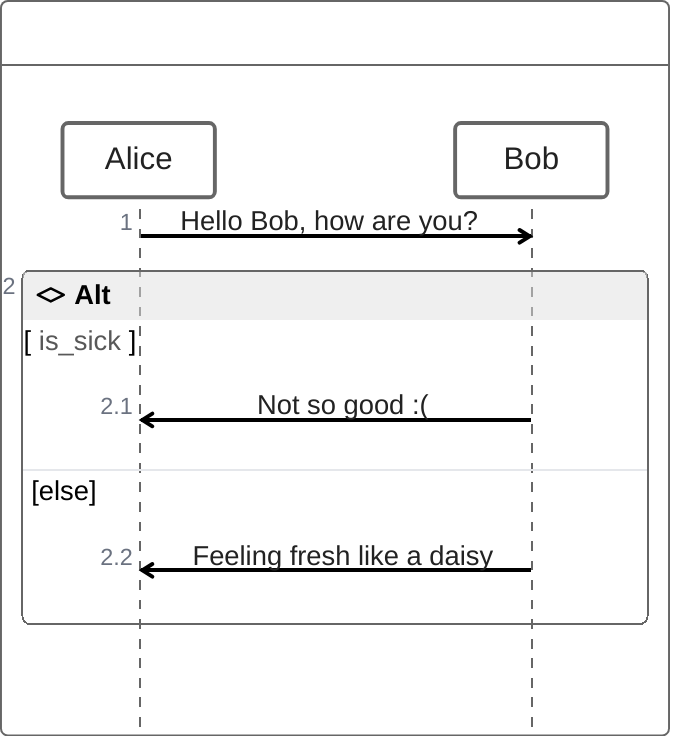
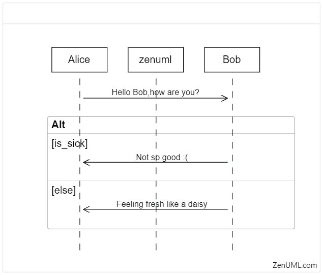

## javascript экосистема на страже boilerplate в технической спецификации

## ❓ Вопрос ❓
### ведёте ли вы в своих проектах документацию от разработчиков и для разработчиков

### поднимите руку ✋ если да

## Зачем мне техническая спецификация
> Технический дизайн / технический анализ
1. Решение проблем на раннем этапе
1. Источник технического задания для реализации
1. Защита детальной оценки работы
1. История развития

<!-- Таким образом техническая спецификация может быть использована на любом из этапов жизни решения.
Более того техническая спецификация моего продукта ни раз пригождалась как ответы на запросы в консультациям из других продуктов. Ведь очень удобно не просто отвечать, вот посмотрите как у нас сделано по коду, а предметно скинуть ссылку на материал -->
<!-- Technical Requirment specification (Техническую спецификацию требований) -->

## Тех.дизайны 1.0
> Как-нибудь, что-нибудь в какой-нибудь структуре

1. Придумай структуру
1. Напиши дизайн
1. Получи кучу не предметных замечаний
1. Перепиши ...
1. Дизайн окончен
<!-- 
Проблемы: 
1. сложно восстановить последовательность решений, которые привели именно к текущей реализации.
2. Когнитивная нагрузка на вспоминание или придумывание формата очередной спеки.
3. Сложно взять задачу на дизайн новому человеку т.к. задание творческое от и до.
 -->

## Тех.дизайны 2.0
> В выверенной структуре с использованием всей мощи системы знаний

1. Функциональная архитектура
1. Архитектура данных
1. Программная архитектура
1. Обзор API
1. Функциональная спецификация (ФС)
1. Концепции
1. Оценки
<!-- ФС находится как-бы на стыке документа разработчика и документа для менеджмента. С одной стороны этот документ для заказчика работы и согласований. С другой разработка должна на него ориентироваться -->

## Недостатки системы тех.дизайны 2.0
1. Boilerplate
1. Ограничения по автоматизации (дороговизна/невозможность)
1. Процесс ревью на полу ручном приводе
<!-- порядка 60% галочек остаются не проставлены никогда -->

## ❓ Вопрос ❓
### Есть ли у вас друг подруги друга, который всё пытается представить как код в Git?

### поднимите руку ✋, если Да

## Тех.дизайны 3.0
> документация как код.

1. богатая база работы с информацией - Asciidoc
1. ~~[...Архитектура данных]~~ => dataschema.puml
1. ~~[...Обзор API]~~ => api.yaml - openapi 3.x
1. генерация boilerplate - plopjs
1. презентации - markdown + marpit
1. цельность дизайна, привязка к работе - git + conventional commits + интеграции с таск-трекерами
<!--  -->

## ❤ Текст - Asciidoc
1. Похоже на markdown
1. Макросы
1. Богатые таблицы
1. Небольшие улучшения синтаксиса
1. Широкая поддержка редакторами и системами управления кодом (gitlab, github...)

<!-- _footer: "[разбор слабых сторон синтаксиса markdown](https://habr.com/ru/articles/536448/)" -->

## Asciidoc


## 🔶Диаграммы - PlantUml
1. стандарт дэ факто ⚠
1. [plantuml.js](https://github.com/plantuml/plantuml.js) (WASM)😒

<!-- _footer: "[сайт PlantUml](https://plantuml.com/) -->
<!-- Серьёзно рассматривать plantuml.js нет смысла т.к. очень медленно и переваривает не все примеры диаграмм plantml -->

## 🔶Диаграммы - PlantUml


## ❓ Вопрос ❓
### кто-нибудь знает технологию для диаграмм на лучшем в мире языке?

## 🔶❤ "Правильные" диаграммы - Mermaid
1. Написано на JS 💕
1. Имеет диаграммы, которых нет в plantuml 👌
1. [расширяемость, динамика](https://mermaid.js.org/community/newDiagram.html) 👍
1. Поддерживает ZenUML 😎

<!-- _footer: "[mermaid](https://mermaid.js.org/)" -->

## 😎 ZenUML. Код


## ZenUML. На выходе


## Презентации. MarpIt
```markdown
---
marp: true
headingDivider: 2
paginate: true
_paginate: false
html: true
---

# Первый слайд
Контент первого слайда

---

# Второй слайд

```
<!-- _footer: "[marpit](https://marpit.marp.app/?id=getting-started)" -->

## Бойлерплейту бой - plop

1. простой
1. под капотом - inquirer prompts + handlebars

<!-- _footer: "[сайт Plop](https://plopjs.com/)" -->
<!--  -->

## dataschema.puml - planter

1. первая строчка в поиске 😊
1. применимо к PostgreSQL
1. простой (`planter postgres://planter@localhost/planter?sslmode=disable -o example.uml`)

<!-- _footer: "[planter](https://github.com/achiku/planter)" -->

## api.yaml - OpenAPI/Swagger Specification

1. Промышленный стандарт
1. Тулинг для написания, тестирования...

## Структура дизайн проекта

```
works - работы = фичи
   `${ticket-key}-${short-description}`
   где `${ticket-key}` - ключ задачи
   `${short-description}` - краткое описание сути фичи
      0-concept - концепты в свободной форме
      1-estimate-be.adoc
      2-estimate-fe.adoc
      ...
      index.adoc - бизнес + технический анализ
api.yaml
glossary.adoc
user-stories.adoc - сюда на каждую фичу подставляется шаблон UserStory
scripts
  entities.mjs - массив сущностей для сквозной каталогизации
index.adoc - входная точка с описанием и ссылками
```

## Результат
> Всё тоже самое, но проще 😁
1. Избавление от лишних сущностей
1. Ускорение старта работы над фичей
1. Прозрачный, сквозной процесс работы над фичей в одной системе координат