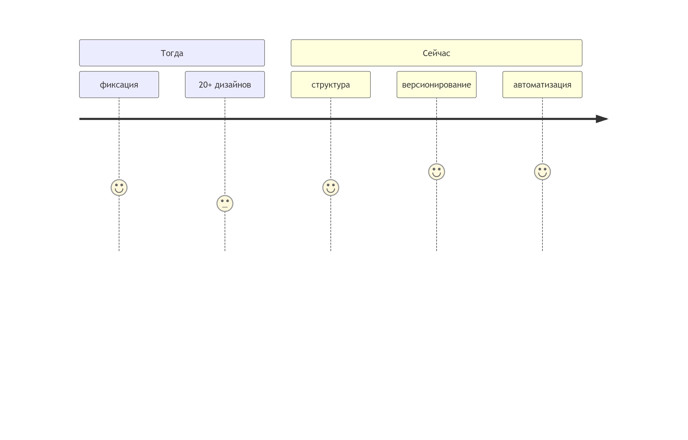
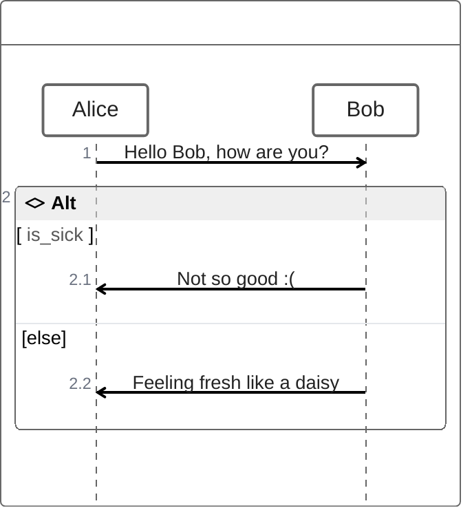

## Про дизайн, но технический. Зачем и как?

----


* 7 лет в коммерческой разработке
* 5 команд
* 7 продуктов
* 4 роли
    * тестировщик
    * разработчик
    * тимлид
    * наставник
* 🏄‍♂️ 👩‍💻 🍻
<style scoped>ul { list-style: none; }</style>
🙏 [telegramm](https://t.me/alexey_shcherbakov) | [linkedin](https://www.linkedin.com/in/shcherbakov/) | [GitHub](https://github.com/akaguny)

<!-- 
последние 7 лет я занимаюсь разработкой ПО
за это время удалось поработать в 5 командах
над 7 продуктами в различных ролях.
с гордостью могу сказать что побывал в ролях
тестировщика ручного и автоматизатора
разработчика, тимлида и наставника.
последние 3 года занимаюсь управлением командой совместно с разработкой frontend
 -->


## План
* Зачем нужен технический дизайн?
<!-- описание контекста, в котором работаю, с какими проблемами сталкиваюсь и чем помогает технический дизайн -->
* Что такое технический дизайн и чем отличается от технической документации?
<!--  -->
* В чём мой "чемпионский подход к ведению технических дизайнов"?
  * Как это работает?
  * Какие инструменты использованы?
* Итоги

## Зачем нужен технический дизайн?

## Контекст проекта
* техника
* процессы

<style scoped>ul {font-size:48px; padding: 0; list-style: none; }</style>

## Контекст. Техника

* компонент продукта
  * frontend
  * backend
  * QG

* дифференцированный стек
  * backend - Java
  * frontend - React
  * testing - Java, Selenium
  * devOps - Ansible, Jenkins

<!-- 
Приложение, пользователями которого являются сотрудники клиента
Имеет собственный UI
Собственный backend с персистентным хранилищем - базой данных
Собственный Quality Gate - все уровни тестирования от юнит тестов и до приёмочных E2E тестов, моделирующих работу через браузер
 -->

## Контекст. Процессы

* разработка фичи "под ключ"
  * планирование
  * аналитика
  * реализация
  * поддержка
* инженеры на проекте могут меняться

<!-- 
Команда участвует на всех этапах разработки

Планирование
Подготовка документа с прогнозом по реализации с детализацией до работ по функциональных направлений - backend, frontend, тестирование и devops
Поддержка
Инженеры проекта занимаются разбором ошибок с прома

-->

## Риски
* потеря связи с реальностью
* рассинхронизация
* дорогое вхождение в проект

<!--

На таком проекте возрастают следующие риски
потеря связи с реальностью - команда разработки реализует объёмную фичу, но реализует её с критичными для бизнес потребности ограничениями

рассинхронизация - стек дифференцирован и требуется от 3 инженеров её реализующих, рискуем превратиться в героев басни лебедь, рак и щука. А узнать про всё это к моменту интеграции

дорогое вхождение в проект - вхождение в проект требует высокого погружения в контекст проекта. Что увеличивает издержки на "онбординг" как вновь прибывших в компанию, так и инженеров некогда работающих над проектом

 -->
---

* ### Похоже на ваш проект?
* ### Разрабатываете на React?


<style scoped>ul { list-style: none; }</style>

<!-- 

Доклад будет особенно полезен для тех, кто также работает в кроссфункциональной команде.
Но подходы которые мы разберём и инструменты я сейчас использую на всех проектах, где имею возможность.
 -->

## Чем Техническая документация отличается от Технического дизайна?

<!-- 
Технический дизайн это не только техническая документация.

Далее рассмотрим основные элементы технической документации и технического дизайна, с которыми вы могли сталкиваться
 -->

---


### Readme.md - Техническая документация
* как разрабатывать
* как пользоваться
<style scoped>ul { padding: 0; list-style: none; }</style>
<!-- 
Простой пример технической документации - Readme.md
Отвечает на вопросы
как разрабатывать, как пользоваться
 -->

## RFC React. Формат
```markdown
# Summary
...
# Basic example
...
# Motivation
...
# Detailed design
...
# Drawbacks
...
# Alternatives
...
# Adoption strategy
...
# How we teach this
...
# Unresolved questions
```
<!-- 
Формат RFC - Request For Comments на примере React представляет из себя обычный Markdown файл с заданной структурой.
Но сколько замечательных и не очень фич было разработано с его использованием
 -->

<!-- _footer: "[Проект RFCs for changes to React](https://github.com/reactjs/rfcs)" -->

## RFC. Процесс
* создание
* обсуждение
* финальное решение
* активен
* реализован

<!-- процесс взят из Ember потому как он был расписан по пунктам. А React заимстовал у Yarn и Ember =) -->

<!-- 
Сам по себе файл в каком-то формате это хорошо, но это лишь инструмент.
То, как он используется описывает процесс
-->

## интернет стандартизируют через RFC
* RFC1 был опубликован 1969 году
* семейство протоколов TCP/IP описано в RFC
<!-- 
Первый RFC был опубликован в конце 60-х годов прошлого века
Весть этот наш интернет описывается через RFC
 -->

## Технические дизайн. Маппинг на процесс

* планирование - концепция
* аналитика - уточнение концепции, детальный анализ
* реализация - корректировки
* поддержка - дизайн может быть использован в документации

## Технический дизайн и техническая документация снижают риски
|риск|решение|
|---|---|
|потеря связи с реальностью|дизайн-ревью|
|рассинхрон|дизайн-ревью|
|онбординг|чтение дизайнов и документации|

## Технический дизайн вещь хорошая. Будем использовать!

---

<!-- https://mermaid.live/edit#pako:eNptkb9OwzAQxl_FupUOCOjimZWJNYuVuBDUJCh1hqqqlKT8GVl4Ad4gCkSkVRte4bs34tKoFSA82Kf7vvPvfF6QnwSWNN0lWRrbuRcrWTPruzCJFV7RKX5Ggy2-0KLDjgts5HwXQVIdPvix31ENlUrxgxg3Yqv4CS2_aHVxkM5OT5RYW3yiwho7Kay1Ov_DfPuP2GL7m9dhfSQWXHLOK6GWvOIc1Q8majQiFsNd0lDeU4UvMRqtxkdjhZpLEbfSeTk0eXjBmEYU2TQyYSCjWvQlHrlbG1mPtISBnZhs6jzy4qVYTeaS63nsk3ZpZkeU3QfG2cvQ3KQmIj0x05lkbRC6JL0axr__heU3zmvH9Q 
-->

## ❓ Вопрос ❓
### Есть ли у вас друг подруги друга, который всё пытается представить как код в Git?

### поднимите руку ✋, если Да

## Что угодно как код

* стандартизируемость
* масштабируемость
* переносимость
* аудит

<!-- _footer: "[octopus - What is Everything as Code?](https://octopus.com/blog/what-is-everything-as-code)" -->

# Что такое технический дизайн и чем отличается от технической документации?

## Demo aka 🥩Мяско © Татьяна / 🍆Мякотка © Инна
### Разработка через технический дизайн для проекта, приближенного к боевому

## Результаты
* легкодоступная фактура для сверки с первоначальной задачей
* синхронизация в рамках обычного процесса разработки
* никаких "исторически так сложилось"

## Инструменты
* идём от базовых потребностей
* избегаем регресса по функциональности
* избегаем вендор лока
* популярное решения, знания которых инженеру пригодятся

## Требования к тексту
* базовое форматирование
* карта документа
* автоматическая нумерация заголовков
* включение одних документов в другие
* вставка в документ диаграмм и картинок
* отсутствие вендор лока

## Текст - ❤ Asciidoc
* markdown на стероидах
  * любой markdown можно конвертировать в adoc
  * автоматическая нумерация списков
  * многострочные ячейки в таблицах
* опробирован - активно используется техническими писателями и крупными компаниями (Red hut, Couchbase...)
* интегрирован в среды разработки - поддержка редакторами кода и рендерами решений совместной разработки (gitlab, github...)
* документирован - качество документации

<!-- _footer: "[разбор слабых сторон синтаксиса markdown](https://habr.com/ru/articles/536448/)" -->

## Пример Asciidoc


## 🔶Диаграммы - PlantUml
1. стандарт дэ факто ⚠
1. [plantuml.js](https://github.com/plantuml/plantuml.js) (WASM)😒

<!-- _footer: "[сайт PlantUml](https://plantuml.com/) -->
<!-- Серьёзно рассматривать plantuml.js нет смысла т.к. очень медленно и переваривает не все примеры диаграмм plantml -->

## Динамические аспекты поведения системы
### Диаграмма последовательностей - 80% потребностей
* сценарии
* взаимодействие внутри продукта и во вне

## Архитектура
* диграмма компонент

## Схема базы данных
### Диаграммы «сущность-связь» (или ERD)

## Описание API
### Openapi

## 🔶Диаграммы - PlantUml


## ❓ Вопрос ❓
### кто-нибудь знает технологию для диаграмм на лучшем в мире языке?

## 🔶❤ "Правильные" диаграммы - Mermaid
1. Написано на JS 💕
1. Имеет диаграммы, которых нет в plantuml 👌
1. [расширяемость, динамика](https://mermaid.js.org/community/newDiagram.html) 👍
1. Поддерживает ZenUML 😎

<!-- _footer: "[mermaid](https://mermaid.js.org/)" -->

## 😎 ZenUML. Код



## ZenUML. На выходе


## Презентации. MarpIt
```markdown
---
marp: true
headingDivider: 2
paginate: true
_paginate: false
html: true
---

# Первый слайд
Контент первого слайда

---

# Второй слайд

```
<!-- _footer: "[marpit](https://marpit.marp.app/?id=getting-started)" -->

## Бойлерплейту бой - plop

1. простой
1. под капотом - inquirer prompts + handlebars

<!-- _footer: "[сайт Plop](https://plopjs.com/)" -->
<!--  -->

## dataschema.puml - planter

1. первая строчка в поиске 😊
1. применимо к PostgreSQL
1. простой (`planter postgres://planter@localhost/planter?sslmode=disable -o example.uml`)

<!-- _footer: "[planter](https://github.com/achiku/planter)" -->

## api.yaml - OpenAPI/Swagger Specification

1. Промышленный стандарт
1. Тулинг для написания, тестирования...

## Напутствие
1. делай дизайны
1. не делай так
1. делай

## Без них не было бы этого доклада😘
|кому|за что|
|---|---|
|орг. Комитет Piterjs, в особенности Илье Государеву|прогоны, возможность выступить|
|[Nexign Academy](https://nexign.com/ru/nexign-academy), в особенности Татьяне Кульбякиной|прогоны|
|👨‍👧‍👦жене, дочке и сыну|⌛

---

<!-- Связаться со мной можно в телеграм, а лучше сразу адресовать вопросы во флудилке Piterjs -->
