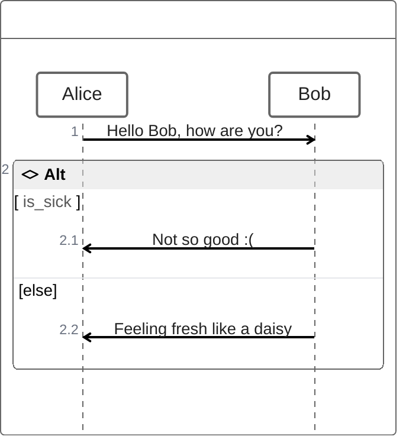

## Что такое технический дизайн, почему не стоит вести их в Wiki и как с помощью экосистемы javascript слезть с неё.

## Слайд о себе

## Содержание
1. Глоссарий
    1. Техническая документация
    1. Технический дизайн
1. Контекст проекта
1. Проблематика
1. Эволюция решения
1. Инструменты
1. Итоги

## ❓ Вопрос ❓
### знакомы ли вам Readme.md от React Create App, AngularCLI, VITE...?

### поднимите руку ✋ если да

## Readme.md - техническая документация
### Отвечает на вопрос что сделано и как этим пользоваться, но не на вопрос что предстоит сделать.

## ❓ Вопрос ❓
### знакомы ли вам RFC (React RFC, TC39 Proposals)?

### поднимите руку ✋ если да

## RFC - Технический дизайн
* О чём речь?
* Какова мотивация?
* Почему так и не иначе?
* Какие есть риски / возможности?
... и так далее ...

## ❓ Вопрос ❓
### работаете или работали ли вы в кроссфункциональной команде, где есть чётко распределённые роли Backend / Frontend / QA...?

### поднимите руку ✋ если да

## Контекст. Техника

1. компонент (модуль) продукта
1. дифференцированный стек
    1. backend - java
    1. frontend - react
    1. testing - java, selenium

<!-- 
1. это означает, что есть внутренние интеграции с другими компонентами в продукта
2. стек дифференцирован как по технологиям, так и по инженерам, которые специализируются на этих технологиях
 -->

## Контекст. Процессы

1. Экспресс оценка
1. Уточнение оценки
1. Декомпозиция, реализация, релиз, поддержка

<!-- 
Процесс на слайде представлен как линейный. Но конечно же это не так.
Где-то влияют сжатые сроки, где-то сложность фичи, где-то ещё какие-то точки рисков.
 -->

## ❓ Вопрос ❓
### Бывало ли так, что ближе к концу разработки выясняется что кто-то кого-то недопонял и сделали не совсем то, что надо?

### поднимите руку ✋, если Да

## Проблема синхронизации
### Решение - технические дизайны.

1. Stage 1 - Концепция (экспресс оценка)
1. Stage 2 - технический дизайн (уточнение оценки и декомпозиция)
1. Stage 3-4 - Реализация... 

* Придумаем систему, будем всё ревьюить. Построим прозрачную и надёжную связь на ссылках 😁

## ❓ Вопрос ❓
### Знакомы ли вам такие Wiki как Confluence ?
### поднимите руку ✋, если Да

## технические дизайны в Wiki. Восход

1. Задали структуру, под каждую фичу набор дизайнов 
    1. функциональная архитектура
    1. дизайны по каждому направлению
    1. общий дизайн
      1. схема данных
      1. архитектура
          1. контракты (внешние и внутренние интеграции)
          1. логическая схема компонент

<!-- 
Проблемы: 
1. сложно восстановить последовательность решений, которые привели именно к текущей реализации.
2. Когнитивная нагрузка на вспоминание или придумывание формата очередной спеки.
3. Сложно взять задачу на дизайн новому человеку т.к. задание творческое от и до.
 -->

## технические дизайны в Wiki. Падение

1. Boilerplate
1. процесс ревью как-бы есть и как-бы нет
1. ограничения по автоматизации (дороговизна/невозможность)
1. информация дублируется, теряется
<!-- 
1. механика инстанцирования нового набора дизайнов строилась на операции копирования. Так например можно заменить значения одни на другие в заголовках, но что-то более мощное по типу автоматического проставления тех самых лейблов вручную.

2. процесс ревью был организован как таски в документе. Таски это хорошо, но как думаете, как часто кто-то обнулял таски при изменении документа? А сколько тасков висит на сотрудниках, которые никогда их уже не проставят?)
Отвечаю, порядка 60% галочек остаются не проставлены никогда.

3. Основные ограничения с которыми столкнулся - внешние плагины, а точнее данные на основе которых например появляется диаграмма или что-нибудь ещё не доступны через API Confluence. И даже если вытащить получилось, то с созданием или обновлением контента с использованием расширений функциональности большие трудности.
-->

## ❓ Вопрос ❓
### Есть ли у вас друг подруги друга, который всё пытается представить как код в Git?

### поднимите руку ✋, если Да

## Что угодно как код

* стандартизируемость
* масштабируемость
* переносимость
* аудит

<!-- _footer: "[octopus - What is Everything as Code?](https://octopus.com/blog/what-is-everything-as-code)" -->

## Технический дизайн как код
> обеспечим все потребности хорошо изученными инструментами. Остальное добьём масштабируемыми.

1. ревью - Merge Request, git flow
1. функциональность wiki по работе с тектом - Asciidoc
1. ~~boilerplate~~ => plopjs
1. ~~[...Изменения в БД]~~ => dataschema.puml
1. ~~[...Изменения в контрактах]~~ => api.yaml - openapi
1. презентации - markdown + marpit

## ❤ Текст - Asciidoc
1. Похоже на markdown
1. Макросы
1. Богатые таблицы
1. Небольшие улучшения синтаксиса
1. Широкая поддержка редакторами и системами управления кодом (gitlab, github...)

<!-- _footer: "[разбор слабых сторон синтаксиса markdown](https://habr.com/ru/articles/536448/)" -->

## Пример Asciidoc


## 🔶Диаграммы - PlantUml
1. стандарт дэ факто ⚠
1. [plantuml.js](https://github.com/plantuml/plantuml.js) (WASM)😒

<!-- _footer: "[сайт PlantUml](https://plantuml.com/) -->
<!-- Серьёзно рассматривать plantuml.js нет смысла т.к. очень медленно и переваривает не все примеры диаграмм plantml -->

## 🔶Диаграммы - PlantUml


## ❓ Вопрос ❓
### кто-нибудь знает технологию для диаграмм на лучшем в мире языке?

## 🔶❤ "Правильные" диаграммы - Mermaid
1. Написано на JS 💕
1. Имеет диаграммы, которых нет в plantuml 👌
1. [расширяемость, динамика](https://mermaid.js.org/community/newDiagram.html) 👍
1. Поддерживает ZenUML 😎

<!-- _footer: "[mermaid](https://mermaid.js.org/)" -->

## 😎 ZenUML. Код


## ZenUML. На выходе


## Презентации. MarpIt
```markdown
---
marp: true
headingDivider: 2
paginate: true
_paginate: false
html: true
---

# Первый слайд
Контент первого слайда

---

# Второй слайд

```
<!-- _footer: "[marpit](https://marpit.marp.app/?id=getting-started)" -->

## Бойлерплейту бой - plop

1. простой
1. под капотом - inquirer prompts + handlebars

<!-- _footer: "[сайт Plop](https://plopjs.com/)" -->
<!--  -->

## dataschema.puml - planter

1. первая строчка в поиске 😊
1. применимо к PostgreSQL
1. простой (`planter postgres://planter@localhost/planter?sslmode=disable -o example.uml`)

<!-- _footer: "[planter](https://github.com/achiku/planter)" -->

## api.yaml - OpenAPI/Swagger Specification

1. Промышленный стандарт
1. Тулинг для написания, тестирования...

## Структура дизайн проекта

```
works - работы = фичи
   `${ticket-key}-${short-description}`
   где `${ticket-key}` - ключ задачи
   `${short-description}` - краткое описание сути фичи
      0-concept - концепты в свободной форме
      1-estimate-be.adoc
      2-estimate-fe.adoc
      ...
      index.adoc - бизнес + технический анализ
api.yaml
glossary.adoc
user-stories.adoc - сюда на каждую фичу подставляется шаблон UserStory
scripts
  entities.mjs - массив сущностей для сквозной каталогизации
index.adoc - входная точка с описанием и ссылками
```

## Результат
> Всё тоже самое, но проще 😁
1. Избавление от лишних сущностей
1. Ускорение старта работы над фичей
1. Прозрачный, сквозной процесс работы над фичей в одной системе координат