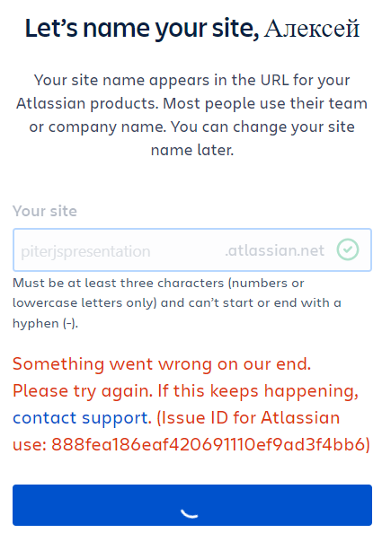
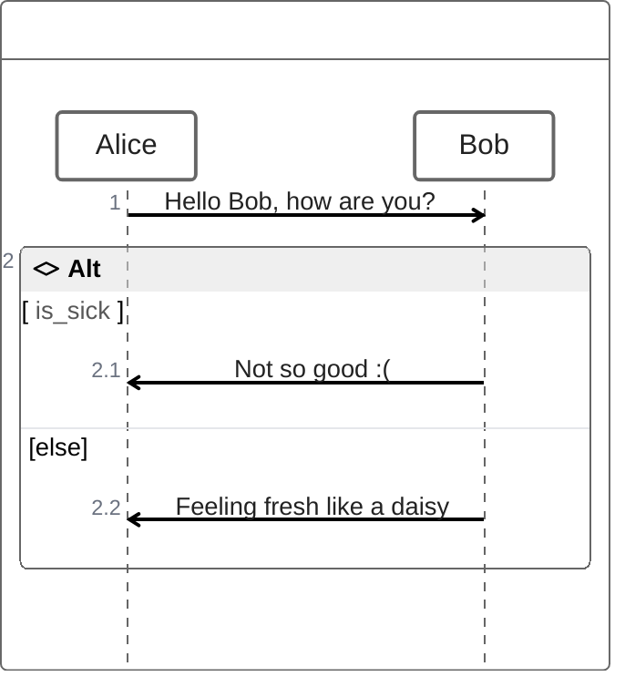

## Про дизайн, но технический. Зачем и как?

## Слайд о себе
<!-- _class: cover -->

## Содержание
* контекст
* боль
* пилюля
* побочки
* что и как оптимизировали
  * критерии выбора решения
  * критерии для оптимизации
* к каким результатам пришли

## контекст моего типичного проекта
* модульный
* смежники
* реализует конкретные бизнес-потребности
* один из нескольких
* параллельная реализация

<!-- 
область процесса, которую будем рассматривать это разработка
 -->

## проблемы 
* потеря связи с реальностью
* рассинхроны
* онбординг
* помнить всё не реально


## Потому-что могу
<!-- 
задачу обсудили раз
два
надоело
пошли делать
делали-делали и вот получился кодоКрокодил или не крокодил,
выясняем что за зверь
переделывать страшно - принимаем решение вместе с реализацией
 -->
## Не запостил - не было
<!-- 
поговорили
пока делали ещё 100 раз переговорили с лагами по времени естественно
получилось то, но не совсем
пытаемся понять начальную задумку, обнуление, печаль, реверс инжениринг
 -->
## Требуемый опыт работы над проектом от 3 лет
<!-- 
что-бы работать на нашем проекте нужен онбординг с фулл-тайм ментором и парным программированием
а лучше если у тебя уже будет опыт работы от 3 лет
 -->
## решения
|||
|---|---|
|потеря связи с реальностью|дизайн-ревью|
|рассинхрон|дизайн-ревью, мерж-ревью|
|онбординг|документация|
|память|дизайн, документация, записи|

## ❓ Вопрос ❓
### знакомы ли вам Readme.md от React Create App, AngularCLI, VITE...?

### поднимите руку ✋ если да

## Глоссарий. документация
### Отвечает на вопрос что сделано и как этим пользоваться, но не на вопрос что предстоит сделать.

## ❓ Вопрос ❓
### знакомы ли вам RFC (React RFC, TC39 Proposals)?

### поднимите руку ✋ если да

## Глоссарий. дизайн, но технический
> видение технической реализации, оформленное в документе

* О чём речь?
* Какова мотивация?
* Почему так и не иначе?
* Какие есть риски / возможности?
... и так далее ...

## технические дизайн. Жизненный цикл

1. Stage 1 - концепция (экспресс оценка)
1. Stage 2 - технический дизайн (уточнение оценки и декомпозиция), чемпион
1. Stage 3-4 - реализация во всех компонентах

## ❓ Вопрос ❓
### Знакомы ли вам такие Wiki как Confluence ?
### поднимите руку ✋, если Да

## wiki

1. Задали структуру, под каждую фичу набор дизайнов
    1. страничка с оценками
    1. функциональная архитектура
    1. дизайны по каждому направлению
    1. общий дизайн
      1. схема данных
      1. архитектура
          1. контракты (внешние и внутренние интеграции)
          1. логическая схема компонент

<!-- 

 -->

## Что получилось на примере реального wiki

<!-- Упс. К сожалению мне не удалось подготовить пример для наглядности -->

## Что получилось на примере псевдокода

## Плюсы и минусы

* Плюсы:
    * анализ стандартизирован
    * процесс обратной связи управляем
    * высокая остаточная стоимость
* Минусы:
    * процесс обратной связи как-бы есть и как-бы нет. Требуется администрирование
    * вендор лок


## технические дизайны в Wiki. Падение

1. Boilerplate
1. процесс ревью как-бы есть и как-бы нет
1. ограничения по автоматизации (дороговизна/невозможность)
1. информация дублируется, теряется
<!-- 
1. механика инстанцирования нового набора дизайнов строилась на операции копирования. Так например можно заменить значения одни на другие в заголовках, но что-то более мощное по типу автоматического проставления тех самых лейблов вручную.

2. процесс ревью был организован как таски в документе. Таски это хорошо, но как думаете, как часто кто-то обнулял таски при изменении документа? А сколько тасков висит на сотрудниках, которые никогда их уже не проставят?)
Отвечаю, порядка 60% галочек остаются не проставлены никогда.

3. Основные ограничения с которыми столкнулся - внешние плагины, а точнее данные на основе которых например появляется диаграмма или что-нибудь ещё не доступны через API Confluence. И даже если вытащить получилось, то с созданием или обновлением контента с использованием расширений функциональности большие трудности.
-->

## ❓ Вопрос ❓
### Есть ли у вас друг подруги друга, который всё пытается представить как код в Git?

### поднимите руку ✋, если Да

## Что угодно как код

* стандартизируемость
* масштабируемость
* переносимость
* аудит

<!-- _footer: "[octopus - What is Everything as Code?](https://octopus.com/blog/what-is-everything-as-code)" -->

## Технический дизайн как код
> обеспечим все потребности хорошо изученными инструментами. Остальное добьём масштабируемыми.

1. ревью - Merge Request, git flow
1. функциональность wiki по работе с тектом - Asciidoc
1. ~~boilerplate~~ => plopjs
1. ~~[...Изменения в БД]~~ => dataschema.puml
1. ~~[...Изменения в контрактах]~~ => api.yaml - openapi
1. презентации - markdown + marpit

## Выбор инструментов для решения. Базовые требования
* идём от базовых потребностей
* избегаем регресса по функциональности
* избегаем вендор лока
* популярное решения, знания которых инженеру пригодятся

## Требования к тексту
* базовое форматирование
* карта документа
* автоматическая нумерация заголовков
* включение одних документов в другие
* вставка в документ диаграмм и картинок
* отсутствие вендор лока

## Текст - ❤ Asciidoc
* markdown на стероидах
  * любой markdown можно конвертировать в adoc
  * автоматическая нумерация списков
  * многострочные ячейки в таблицах
* опробированое решение - активно используется техническими писателями и крупными компаниями (Red hut, Couchbase...)
* поддержка редакторами кода и рендерами решений совместной разработки (gitlab, github...)
* качество документации

<!-- _footer: "[разбор слабых сторон синтаксиса markdown](https://habr.com/ru/articles/536448/)" -->

## Пример Asciidoc


## 🔶Диаграммы - PlantUml
1. стандарт дэ факто ⚠
1. [plantuml.js](https://github.com/plantuml/plantuml.js) (WASM)😒

<!-- _footer: "[сайт PlantUml](https://plantuml.com/) -->
<!-- Серьёзно рассматривать plantuml.js нет смысла т.к. очень медленно и переваривает не все примеры диаграмм plantml -->

## 🔶Диаграммы - PlantUml


## ❓ Вопрос ❓
### кто-нибудь знает технологию для диаграмм на лучшем в мире языке?

## 🔶❤ "Правильные" диаграммы - Mermaid
1. Написано на JS 💕
1. Имеет диаграммы, которых нет в plantuml 👌
1. [расширяемость, динамика](https://mermaid.js.org/community/newDiagram.html) 👍
1. Поддерживает ZenUML 😎

<!-- _footer: "[mermaid](https://mermaid.js.org/)" -->

## 😎 ZenUML. Код


## ZenUML. На выходе


## Презентации. MarpIt
```markdown
---
marp: true
headingDivider: 2
paginate: true
_paginate: false
html: true
---

# Первый слайд
Контент первого слайда

---

# Второй слайд

```
<!-- _footer: "[marpit](https://marpit.marp.app/?id=getting-started)" -->

## Бойлерплейту бой - plop

1. простой
1. под капотом - inquirer prompts + handlebars

<!-- _footer: "[сайт Plop](https://plopjs.com/)" -->
<!--  -->

## dataschema.puml - planter

1. первая строчка в поиске 😊
1. применимо к PostgreSQL
1. простой (`planter postgres://planter@localhost/planter?sslmode=disable -o example.uml`)

<!-- _footer: "[planter](https://github.com/achiku/planter)" -->

## api.yaml - OpenAPI/Swagger Specification

1. Промышленный стандарт
1. Тулинг для написания, тестирования...

## Структура дизайн проекта

```
works - работы = фичи
   `${ticket-key}-${short-description}`
   где `${ticket-key}` - ключ задачи
   `${short-description}` - краткое описание сути фичи
      0-concept - концепты в свободной форме
      1-estimate-be.adoc
      2-estimate-fe.adoc
      ...
      index.adoc - бизнес + технический анализ
api.yaml
glossary.adoc
user-stories.adoc - сюда на каждую фичу подставляется шаблон UserStory
scripts
  entities.mjs - массив сущностей для сквозной каталогизации
index.adoc - входная точка с описанием и ссылками
```

## Мой результат
> Всё тоже самое, но проще 😁
1. Избавление от лишних сущностей
1. Ускорение старта работы над фичей
1. Прозрачный, сквозной процесс работы над фичей в одной системе координат

## Напутствие
1. делай дизайны
1. не делай так
1. делай